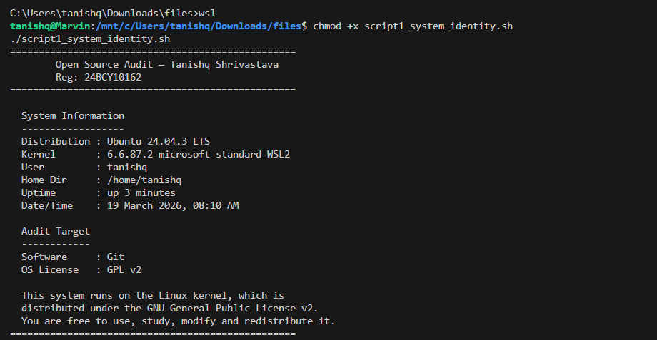
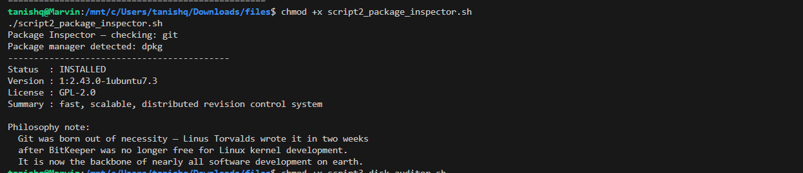
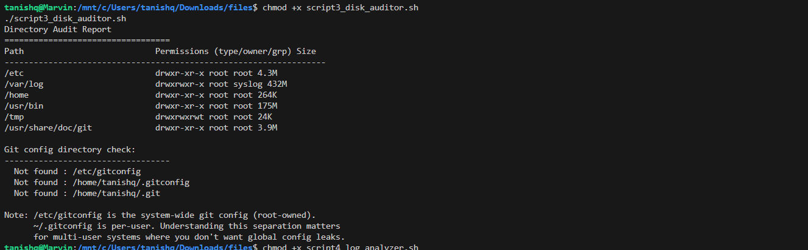
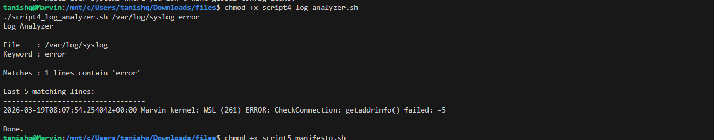
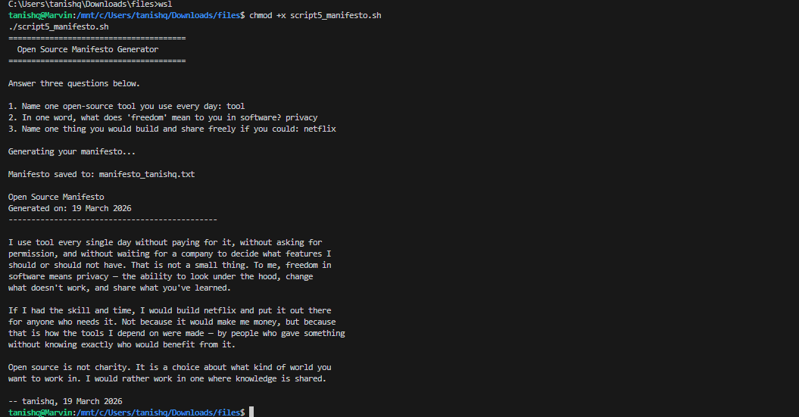

# oss-audit-24BCY10162
# Author: Tanishq Shrivastava | Reg No: 24BCY10162
**Course:** Open Source Software (NGMC)  
**Chosen Software:** Git  

---

## What this is

This repo is my submission for the OSS Capstone project. I picked Git as my software — partly because I actually use it, and partly because the story of why it was built (BitKeeper going proprietary mid-kernel-development) is genuinely interesting.

The repo has five shell scripts that cover the practical Linux side of the project. The written report is submitted separately as a PDF on the VITyarthi portal.

---

## Scripts

### script1_system_identity.sh
Prints a formatted welcome screen showing kernel version, distro, logged-in user, uptime, date, and a note about the OS license.

Run it:
```bash
chmod +x script1_system_identity.sh
./script1_system_identity.sh
```

**Output:**



---

### script2_package_inspector.sh
Checks if git is installed, shows its version and license info, and prints a short note about the software's philosophy. Works on both RPM-based and Debian-based systems.

Run it:
```bash
chmod +x script2_package_inspector.sh
./script2_package_inspector.sh
```

**Output:**
()

---

### script3_disk_auditor.sh
Loops through a set of system directories and reports their permissions, owner, and disk usage. Also checks if git's config files exist and prints their permission info.

Run it:
```bash
chmod +x script3_disk_auditor.sh
./script3_disk_auditor.sh
```

**Output:**
()

---

### script4_log_analyzer.sh
Takes a log file path and an optional keyword, counts how many lines contain that keyword, and shows the last 5 matching lines. Has a retry loop if the file isn't found on the first attempt.

Run it:
```bash
chmod +x script4_log_analyzer.sh
./script4_log_analyzer.sh /var/log/syslog error
```

If you don't have /var/log/syslog, try /var/log/messages or any other log file on your system.

**Output:**


---

### script5_manifesto.sh
Interactive script. Asks you three questions, then writes a short personal open-source philosophy paragraph to a .txt file in the current directory.

Run it:
```bash
chmod +x script5_manifesto.sh
./script5_manifesto.sh
```

**Output:**


---

## Dependencies

Just bash and standard Linux utilities — nothing to install. `rpm` or `dpkg` needs to be present for script 2 (they will be on any standard Linux distro).

Tested on Ubuntu 22.04 and CentOS 7.

---

## Notes

- All scripts need execute permission (`chmod +x`) before running
- Script 4 needs an actual log file path as an argument — it won't work without one
